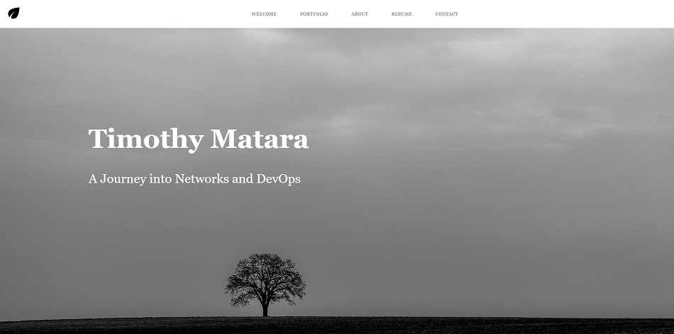

# Professional Profile Page
This is a minimalist design achieved using HTML and pure CSS to build the page. The design was inspired by the journey taken towards achieving relevant digital skills which may seem at times like being at sea. The modern network engineer is faced by a fast paced business environment to deliver solutions continuously, thus the modern network engineer has to learn new skills in AWS, Linux, Python, Ansible, Django, Git, Docker, and network security.

### How to Use
* Create a directory where you will clone this folder
* Clone "https://github.com/kitmikai/profile.git"
* Open index.html in your browser
### Demo
The site has been published on Github pages, [**check it out!**](https://kitmikai.github.io/biopage/)

### Built with
* HTML
* CSS

### To-do
* Use a mobile first approach
* Creating rotating images for the home page
* Add responsiveness using JavaScript

### Feedback
Feel free to send me feedback on Twitter or file an issue. Feature requests are always welcome.

### License
This work is licensed under MIT license.
