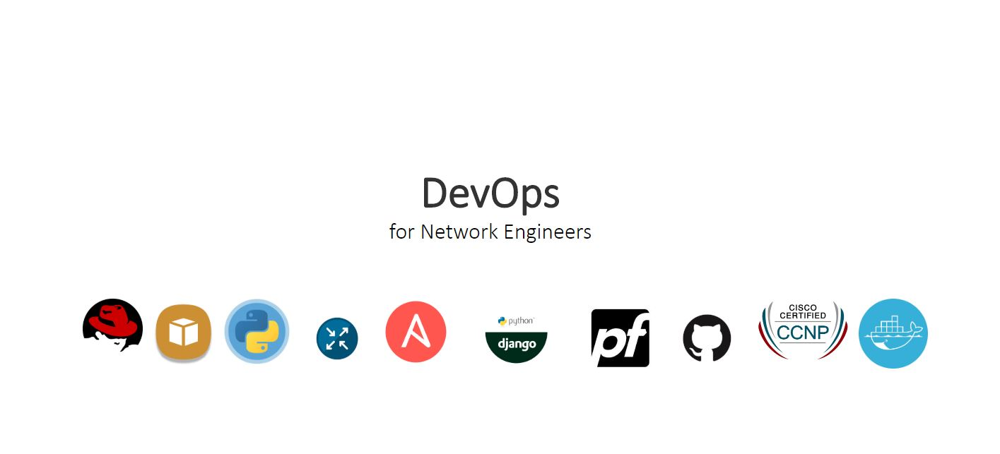

# Profile page
HTML and CSS are important skills for building webpages. This design was done in PowerPoint and then converted to a webpage. The design was inspired by the new way of being Agile, and the increasing demand for solutions to network problems. Being a network engineer is not enough, thus the modern network engineer has to learn new skills in AWS, Linux, Python, Ansible, Django, Git, Docker, and network security.

### Demo
The site has been published on Github pages, [**check it out!**](https://kitmikai.github.io/biopage/)

### Built with
* HTML
* CSS

### To-do
* Use a mobile first approach
* Creating rotating images for the home page
* Add responsiveness using JavaScript

### Feedback
Feel free to send me feedback on Twitter or file an issue. Feature requests are always welcome.
